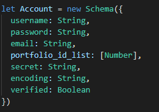
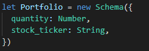
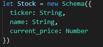
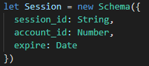
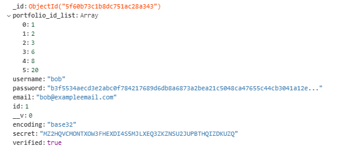
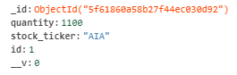
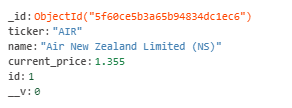

# Stock Portfolio Tracker API

API Website Link: [https://stockportfoliotrackerapinz.azurewebsites.net](https://stockportfoliotrackerapinz.azurewebsites.net)

#### Technologies used:
- Node JS
- Express
- MongoDB

#### Tables created:
- Account
- Portfolio
- Stock
- Session

#### Tables relationship:
- Account to Portfolio (1 to many)
  - Add, delete, edit, and view portfolio given an account ID
- Account to Session (1 to many)
  - One account could have multiple sessions (each session expires after 24 hours)
- Portfolio to Stock (1 to 1)
  - One portfolio is for one stock
  
#### Table type:

#### Example table data:

